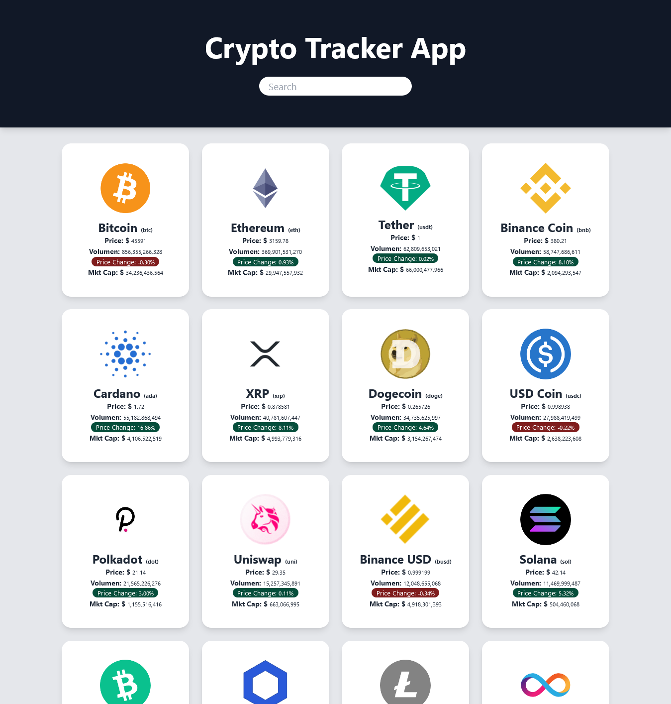

## CRYPTO TRACKER APP

## Available Scripts

In the project directory, you can run:

### `npm run serve`

Runs the app in the development mode.\
Open [http://localhost:8080](http://localhost:8080) to view it in the browser.

The page will reload if you make edits.\
You will also see any lint errors in the console.

### `npm run build:dev`

Mode development.\

### `npm run build:prod`

Mode production.\

